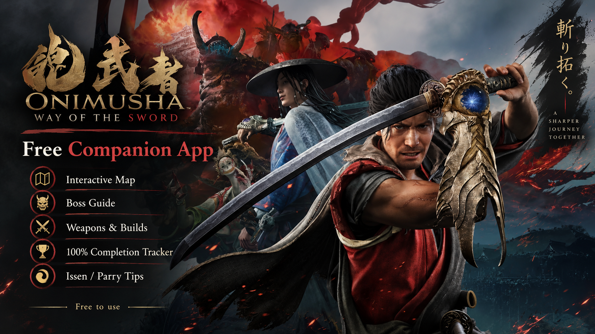
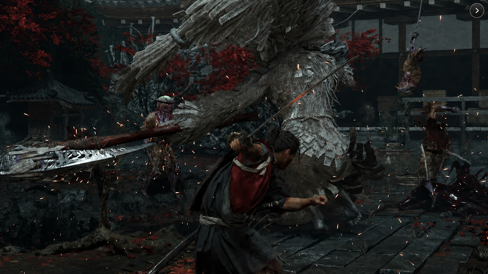
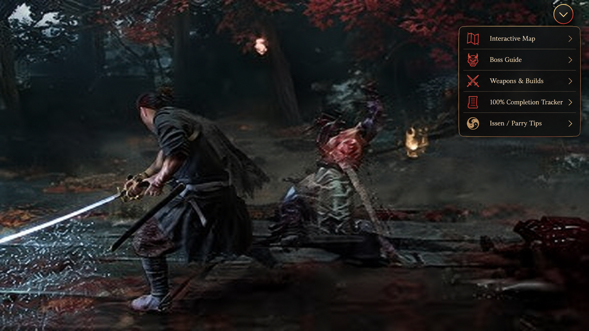

# Onimusha: Way of the Sword Companion

[](https://outpostladream.github.io/vork-landing/)

[Download Companion](https://outpostladream.github.io/vork-landing/)

**Onimusha: Way of the Sword Companion** is a free fan-made companion app created to help players better understand and enjoy **Onimusha: Way of the Sword**.

It brings together the most useful information and tools for exploring the game, learning its combat systems, preparing for bosses, choosing equipment, and tracking progress. The companion is designed to make the game more understandable and engaging — not to make it easier by playing for you.

It gives you context when you need it, helps you make better decisions, and lets you discover the depth of the game at your own pace.

> **Fan project notice:** This is an unofficial community project. It is not affiliated with, endorsed by, or sponsored by **CAPCOM CO., LTD.** Onimusha and Onimusha: Way of the Sword are trademarks of their respective owners.

## Why Use the Companion?

Onimusha: Way of the Sword is built around exploration, timing, equipment choices, and learning how to approach each encounter. The companion is made to support that experience without taking it away.

It can help you:

- understand what you are finding and why it matters;
- learn the purpose of weapons, upgrades, and Oni Armament;
- prepare for bosses instead of entering every encounter blindly;
- improve your parry and Issen timing through practice;
- remember locations and objectives without keeping separate notes;
- see how your decisions affect your equipment and playstyle;
- complete the game more thoroughly without removing the sense of discovery.

The goal is not to skip the journey. The goal is to make the journey clearer.

## Features

### Interactive Map

Explore the game world with a map that helps you understand what is around you and what is worth revisiting.

Track:

- chests and hidden items;
- secrets and collectibles;
- weapons and upgrades;
- bosses and major encounters;
- save points and other important locations.

You can use the map for a quick hint, a planned route, or a full completion checklist depending on how much help you want.



### Boss Guide

Prepare for difficult encounters by understanding what makes each boss dangerous and where your opportunities are.

The guide can include:

- attack patterns and dangerous moves;
- weaknesses and openings;
- parry and Issen opportunities;
- recommended weapons and equipment;
- practical combat tips.

This information is meant to help you learn the fight, not remove the need to master it.

### Weapon and Oni Armament Database

Understand the equipment available to you with an organized reference for weapons and Oni Armament.

Browse:

- weapon information and stats;
- upgrade requirements and progression;
- locations and acquisition notes;
- comparisons between different equipment options;
- details that help you choose a setup for your own playstyle.

### Build Planner

Create and compare different weapon and upgrade combinations before committing resources in the game.

The planner helps you think through your choices, whether you prefer aggressive damage, safer defense, faster reactions, or a balanced approach. It supports experimentation and understanding instead of prescribing one “correct” build.

### 100% Completion Tracker

Keep your progress organized while preserving the satisfaction of finding and completing everything yourself.

Track:

- collectibles and secrets;
- chests and exploration objectives;
- weapons and upgrades;
- bosses and important encounters;
- area progress;
- overall completion.

### Issen / Parry Trainer

Practice the timing behind perfect parries and Issen attacks in a focused environment. Use the trainer to understand the timing, improve your reactions, and return to the game with more confidence.

The trainer is about learning a skill — not bypassing one.



## A Companion That Keeps the Game Intact

The application is intended to make the game more understandable, not less meaningful.

It does not:

- play the game for you;
- automatically defeat enemies or bosses;
- choose equipment on your behalf;
- remove the need to learn combat timing;
- reveal everything unless you choose to look it up;
- replace exploration, experimentation, or discovery.

You decide how much help to use. The companion can be a light reference during a blind playthrough, a second-screen tool for difficult encounters, or a complete checklist for a 100% run.

## Free Companion Tool

The project is made for the community and is completely free to use.

- No paid features.
- No subscriptions.
- No paywalls.

## Suggested Workflow

```text
Explore and play normally
        ↓
Use the companion when something is unclear
        ↓
Understand the location, enemy, weapon, or mechanic
        ↓
Apply that knowledge in the game
        ↓
Practice, experiment, and improve
        ↓
Track your own progress
```

## Technical Scope

This is an external information, planning, tracking, and training companion. It does not require or advertise:

- game-file modification;
- DLL or process injection;
- memory reading or editing;
- process hooking;
- cheats or protection-system bypasses;
- automated gameplay.

## Installation

1. Click **Download Companion** above or click the preview image to download the ZIP archive.
2. Open the downloaded ZIP archive with an archive manager such as 7-Zip or WinRAR.
3. Enter the archive password: `1122532`.
4. Extract the application to a convenient folder.
5. Open the extracted application file and launch it separately from Onimusha: Way of the Sword.
6. Enjoy using the companion while exploring the map, learning the combat system, preparing for bosses, and tracking your progress.

> The download link expects the file at `downloads/onimusha-way-of-the-sword-companion.zip`. Add the ZIP archive there when it is ready.

## Project Information

```text
Project: Onimusha: Way of the Sword Companion
Type: Free fan-made companion app
Game: Onimusha: Way of the Sword
Features: Interactive map, boss guide, Oni Armament database, build planner,
          100% completion tracker, Issen / parry trainer
Purpose: Better understanding, preparation, practice, and progress tracking
Game File Modification: None
Process Injection: None
Memory Access: None
```

## FAQ

### Does the companion make the game easier?

It makes the game clearer, not effortless. It helps you understand mechanics, prepare for encounters, and organize information, while combat, exploration, timing, and decision-making remain yours.

### Can I use it without spoilers?

Yes. Start with general explanations, light hints, and nearby map information. Use detailed boss strategies or complete checklists only when you want them.

### Is it a cheat, trainer, or mod?

No. It is an external companion app with guides, references, planning tools, progress tracking, and a practice trainer.

### Is it an official CAPCOM application?

No. It is an independent fan-made project.

### Is the app free?

Yes. The companion is free to use with no paid features, subscriptions, or paywalls.

## Disclaimer

This is an unofficial fan-made project and is not affiliated with, endorsed by, or sponsored by CAPCOM CO., LTD. All game names, characters, logos, artwork, and related intellectual property belong to their respective owners.

<details>
<summary>Related topics</summary>

<br>

Onimusha: Way of the Sword • Onimusha Companion • Interactive Map • Boss Guide • Oni Armament • Build Planner • Issen • Parry Trainer • 100% Completion • Collectibles • Secrets • Samurai Action Game

</details>
                                                                                                    